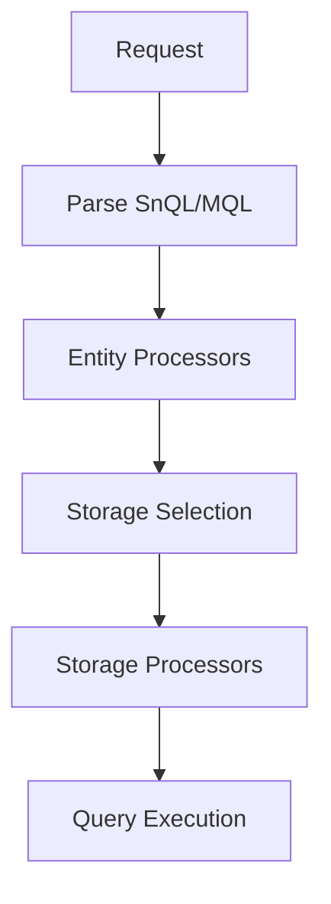

Query processors transform and validate queries as they flow through the execution pipeline.

## Overview

Snuba's query pipeline consists of multiple stages, each with its own processors:



## Processor Interface

All processors implement a common interface:

```python
from abc import ABC, abstractmethod
from snuba.query import ProcessableQuery

class QueryProcessor(ABC):
    @abstractmethod
    def process_query(
        self,
        query: ProcessableQuery,
        query_settings: QuerySettings
    ) -> None:
        """
        Process and transform the query in-place.
        
        Args:
            query: The query to process
            query_settings: Query execution settings
        """
        raise NotImplementedError
```

## Entity Processing Stage

Entity processors run after query parsing, before storage selection.

```python
from snuba.pipeline.stages.query_processing import EntityProcessingStage
from snuba.pipeline.query_pipeline import QueryPipelineResult
from snuba.request import Request
from snuba.utils.metrics.timer import Timer

# Execute entity processing stage
stage = EntityProcessingStage()
result = stage.execute(
    QueryPipelineResult(
        data=request,
        query_settings=request.query_settings,
        timer=timer,
        error=None
    )
)
```

Source: `snuba/pipeline/stages/query_processing.py:14`

### Common Entity Processors

<AccordionGroup>
  <Accordion title="TimeSeriesProcessor">
    Validates and processes time range queries:
    - Ensures required time columns are present
    - Validates time range is reasonable
    - Adds time-based optimizations
    
    ```python
    from snuba.datasets.processors.timeseries_processor import TimeSeriesProcessor
    
    processor = TimeSeriesProcessor()
    processor.process_query(query, query_settings)
    ```
  </Accordion>

  <Accordion title="ProjectRateLimit">
    Enforces project-level rate limits:
    ```python
    from snuba.datasets.processors.project_rate_limiter import ProjectRateLimiter
    
    processor = ProjectRateLimiter()
    processor.process_query(query, query_settings)
    ```
  </Accordion>

  <Accordion title="PrewhereProcessor">
    Optimizes queries using ClickHouse PREWHERE:
    - Moves selective conditions to PREWHERE
    - Improves query performance
    
    ```python
    from snuba.query.processors.prewhere import PrewhereProcessor
    
    processor = PrewhereProcessor()
    processor.process_query(query, query_settings)
    ```
  </Accordion>
</AccordionGroup>

## Storage Processing Stage

Storage processors run after storage selection, before query execution.

```python
from snuba.pipeline.stages.query_processing import StorageProcessingStage

# Execute storage processing stage
stage = StorageProcessingStage()
result = stage.execute(clickhouse_query)
```

Source: `snuba/pipeline/stages/query_processing.py:16`

### Common Storage Processors

<AccordionGroup>
  <Accordion title="MappingOptimizer">
    Optimizes column mapping and projection:
    ```python
    from snuba.datasets.processors.mapping_optimizer import MappingOptimizer
    
    processor = MappingOptimizer(column_mapping)
    processor.process_query(query, query_settings)
    ```
  </Accordion>

  <Accordion title="TableRateLimit">
    Enforces table-level rate limits:
    ```python
    from snuba.datasets.processors.table_rate_limiter import TableRateLimiter
    
    processor = TableRateLimiter()
    processor.process_query(query, query_settings)
    ```
  </Accordion>

  <Accordion title="ConsistencyEnforcer">
    Enforces consistency settings:
    ```python
    from snuba.datasets.processors.consistency import ConsistencyEnforcer
    
    processor = ConsistencyEnforcer()
    processor.process_query(query, query_settings)
    ```
  </Accordion>
</AccordionGroup>

## Creating Custom Processors

You can create custom processors for specific use cases:

```python
from snuba.query.processors import QueryProcessor
from snuba.query import ProcessableQuery
from snuba.query.query_settings import QuerySettings
from snuba.query.expressions import Column, Literal
from snuba.query.conditions import binary_condition, ConditionFunctions

class CustomProjectFilter(QueryProcessor):
    """
    Automatically adds project_id filter to all queries.
    """
    
    def __init__(self, allowed_projects: list[int]):
        self.allowed_projects = allowed_projects
    
    def process_query(
        self,
        query: ProcessableQuery,
        query_settings: QuerySettings
    ) -> None:
        # Add project filter condition
        project_condition = binary_condition(
            ConditionFunctions.IN,
            Column("project_id", None, "project_id"),
            Literal(None, self.allowed_projects)
        )
        
        # Combine with existing condition
        existing = query.get_condition()
        if existing:
            from snuba.query.conditions import combine_and_conditions
            new_condition = combine_and_conditions([existing, project_condition])
        else:
            new_condition = project_condition
        
        query.set_ast_condition(new_condition)

# Usage
processor = CustomProjectFilter(allowed_projects=[1, 2, 3])
processor.process_query(query, query_settings)
```

## Processor Examples

### Add Default Conditions

```python
from snuba.query.processors import QueryProcessor
from snuba.query.conditions import binary_condition, ConditionFunctions
from snuba.query.expressions import Column, Literal

class DefaultConditionsProcessor(QueryProcessor):
    def process_query(self, query, query_settings):
        # Add default deleted = 0 condition
        deleted_condition = binary_condition(
            ConditionFunctions.EQ,
            Column("deleted", None, "deleted"),
            Literal(None, 0)
        )
        
        existing = query.get_condition()
        if existing:
            from snuba.query.conditions import BooleanFunctions
            new_condition = binary_condition(
                BooleanFunctions.AND,
                existing,
                deleted_condition
            )
        else:
            new_condition = deleted_condition
        
        query.set_ast_condition(new_condition)
```

### Transform Column Names

```python
from snuba.query.processors import QueryProcessor
from snuba.query.expressions import Column

class ColumnRenameProcessor(QueryProcessor):
    def __init__(self, mapping: dict[str, str]):
        self.mapping = mapping
    
    def process_query(self, query, query_settings):
        # Walk through all expressions and rename columns
        def rename_visitor(expr):
            if isinstance(expr, Column):
                old_name = expr.column_name
                if old_name in self.mapping:
                    return Column(
                        self.mapping[old_name],
                        expr.table_name,
                        self.mapping[old_name]
                    )
            return expr
        
        # Apply to selected columns
        query.set_selected_columns([
            rename_visitor(col) for col in query.get_selected_columns()
        ])
        
        # Apply to conditions
        condition = query.get_condition()
        if condition:
            query.set_ast_condition(rename_visitor(condition))

# Usage
processor = ColumnRenameProcessor({
    "old_column": "new_column",
    "deprecated_field": "current_field"
})
```

### Add Query Metadata

```python
from snuba.query.processors import QueryProcessor

class MetadataProcessor(QueryProcessor):
    def process_query(self, query, query_settings):
        # Add custom metadata to query
        query.set_experiment("custom_processor", True)
        query.set_experiment("processor_version", "1.0")
        
        # Log processing
        import logging
        logger = logging.getLogger(__name__)
        logger.info(f"Processing query {query}")
```

## Subscription Processors

Subscription-specific processors handle recurring queries:

```python
from snuba.datasets.entity_subscriptions.processors import SubscriptionProcessor

class CustomSubscriptionProcessor(SubscriptionProcessor):
    def process(
        self,
        query: ProcessableQuery,
        metadata: Mapping[str, Any],
        offset: Optional[int]
    ) -> None:
        """
        Process subscription query.
        
        Args:
            query: The subscription query
            metadata: Subscription metadata
            offset: Kafka offset for deduplication
        """
        # Add subscription-specific logic
        pass
    
    def to_dict(self, metadata: Mapping[str, Any]) -> Mapping[str, Any]:
        """
        Serialize processor state to dict.
        """
        return {"custom_data": metadata.get("custom_field")}
```

Source: Entity implements `get_subscription_processors()`

## Query Validation

Validators check query constraints:

```python
from snuba.datasets.entity_subscriptions.validators import (
    EntitySubscriptionValidator,
    InvalidSubscriptionError
)

class CustomValidator(EntitySubscriptionValidator):
    def validate(
        self,
        query: ProcessableQuery,
        metadata: Mapping[str, Any]
    ) -> None:
        # Validate query constraints
        selected = query.get_selected_columns()
        if len(selected) > 10:
            raise InvalidSubscriptionError(
                "Too many selected columns (max 10)"
            )
        
        # Validate metadata
        if "required_field" not in metadata:
            raise InvalidSubscriptionError(
                "Missing required_field in metadata"
            )
```

## Processor Registration

Processors are registered with entities and storages:

```python
from snuba.datasets.pluggable_entity import PluggableEntity

entity = PluggableEntity(
    entity_key=EntityKey.CUSTOM,
    storages=[storage],
    query_processors=[
        CustomProjectFilter([1, 2, 3]),
        DefaultConditionsProcessor(),
    ],
    subscription_processors=[
        CustomSubscriptionProcessor()
    ],
    subscription_validators=[
        CustomValidator()
    ]
)
```

## Pipeline Execution

The full pipeline execution:

```python
from snuba.pipeline.query_pipeline import QueryPipelineResult
from snuba.pipeline.stages.query_processing import (
    EntityProcessingStage,
    StorageProcessingStage
)
from snuba.pipeline.stages.query_execution import ExecutionStage

# Stage 1: Entity processing
entity_result = EntityProcessingStage().execute(
    QueryPipelineResult(
        data=request,
        query_settings=request.query_settings,
        timer=timer,
        error=None
    )
)

# Stage 2: Storage processing
storage_result = StorageProcessingStage().execute(entity_result)

# Stage 3: Execution
final_result = ExecutionStage(
    request.attribution_info,
    query_metadata=query_metadata,
    robust=False
).execute(storage_result)
```

Source: `snuba/web/query.py:36`

## Debugging Processors

Enable debug mode to see processor effects:

```python
from snuba.query.query_settings import HTTPQuerySettings

settings = HTTPQuerySettings(debug=True)

# Execute query with debug enabled
result = run_query(dataset, request, timer)

# Check generated SQL and stats
print(f"SQL: {result.extra['sql']}")
print(f"Stats: {result.extra['stats']}")
print(f"Experiments: {result.extra['experiments']}")
```

## Related

<CardGroup cols={2}>
  <Card title="Datasets" icon="database" href="/api/python/datasets">
    Dataset and entity configuration
  </Card>
  <Card title="Query Builder" icon="hammer" href="/api/python/query-builder">
    Build queries programmatically
  </Card>
</CardGroup>