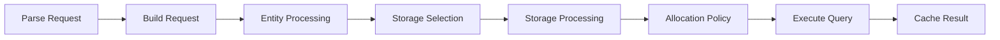

The Query API allows you to execute queries against Snuba datasets using SnQL or MQL.

## Execute Query

<CodeGroup>
```bash POST /query
curl -X POST http://localhost:1218/query \
  -H "Content-Type: application/json" \
  -d '{
    "dataset": "events",
    "query": "MATCH (events) SELECT event_id, group_id, project_id, timestamp WHERE timestamp >= toDateTime('"'"'2024-01-01T00:00:00'"'"') AND timestamp < toDateTime('"'"'2024-01-02T00:00:00'"'"') AND project_id = 1 LIMIT 100",
    "tenant_ids": {
      "organization_id": 1,
      "referrer": "my-service"
    }
  }'
```

```python Python
import requests

response = requests.post(
    "http://localhost:1218/query",
    json={
        "dataset": "events",
        "query": """MATCH (events)
                   SELECT event_id, group_id, project_id, timestamp
                   WHERE timestamp >= toDateTime('2024-01-01T00:00:00')
                     AND timestamp < toDateTime('2024-01-02T00:00:00')
                     AND project_id = 1
                   LIMIT 100""",
        "tenant_ids": {
            "organization_id": 1,
            "referrer": "my-service"
        }
    }
)

result = response.json()
for row in result["data"]:
    print(row["event_id"], row["timestamp"])
```
</CodeGroup>

### Request Body

<ParamField path="dataset" type="string">
  The dataset to query. Optional if querying a storage directly. Examples: `events`, `transactions`, `metrics`
</ParamField>

<ParamField path="query" type="string" required>
  The SnQL query string
</ParamField>

<ParamField path="tenant_ids" type="object" required>
  Tenant identification for attribution and rate limiting
</ParamField>

<ParamField path="tenant_ids.organization_id" type="integer" required>
  Organization ID
</ParamField>

<ParamField path="tenant_ids.referrer" type="string" required>
  Service identifier (e.g., "api", "issues", "discover")
</ParamField>

<ParamField path="consistent" type="boolean" default={false}>
  Force consistent reads from first replica
</ParamField>

<ParamField path="debug" type="boolean" default={false}>
  Include detailed execution stats in response
</ParamField>

<ParamField path="dry_run" type="boolean" default={false}>
  Validate query without executing
</ParamField>

### Response

<ResponseField name="data" type="array">
  Array of result rows
</ResponseField>

<ResponseField name="meta" type="array">
  Column metadata with names and types
</ResponseField>

<ResponseField name="timing" type="object">
  Query timing information
</ResponseField>

<ResponseField name="quota_allowance" type="object">
  Resource quota and allocation details
</ResponseField>

<ResponseField name="stats" type="object">
  Execution statistics (included when `debug: true` or `STATS_IN_RESPONSE` setting enabled)
</ResponseField>

<ResponseField name="sql" type="string">
  Generated Clickhouse SQL (included in debug mode)
</ResponseField>

### Success Response Example

```json
{
  "data": [
    {
      "event_id": "abc123",
      "group_id": 456,
      "project_id": 1,
      "timestamp": "2024-01-01T12:34:56"
    },
    {
      "event_id": "def789",
      "group_id": 789,
      "project_id": 1,
      "timestamp": "2024-01-01T12:35:12"
    }
  ],
  "meta": [
    {"name": "event_id", "type": "String"},
    {"name": "group_id", "type": "UInt64"},
    {"name": "project_id", "type": "UInt64"},
    {"name": "timestamp", "type": "DateTime"}
  ],
  "timing": {
    "timestamp": 1704110096,
    "duration_ms": 245
  },
  "quota_allowance": {
    "summary": {
      "is_successful": true,
      "threads_used": 8
    }
  }
}
```

## Dataset-Specific Query

Query a specific dataset using dedicated endpoints:

<CodeGroup>
```bash POST /{dataset}/snql
curl -X POST http://localhost:1218/events/snql \
  -H "Content-Type: application/json" \
  -d '{
    "query": "MATCH (events) SELECT count() WHERE project_id = 1",
    "tenant_ids": {
      "organization_id": 1,
      "referrer": "analytics"
    }
  }'
```

```bash GET /{dataset}/snql
# GET returns an HTML query interface
curl http://localhost:1218/events/snql
```
</CodeGroup>

## MQL Query

Execute Metrics Query Language queries:

<CodeGroup>
```bash POST /{dataset}/mql
curl -X POST http://localhost:1218/metrics/mql \
  -H "Content-Type: application/json" \
  -d '{
    "query": "sum(d:transactions/duration@millisecond){status_code:200} by (transaction)",
    "tenant_ids": {
      "organization_id": 1,
      "referrer": "metrics-explorer"
    }
  }'
```
</CodeGroup>

### Request Body

Same as SnQL queries, but with MQL syntax in the `query` field.

## Query Settings

Advanced query configuration:

```json
{
  "query": "...",
  "tenant_ids": {...},
  "turbo": false,
  "consistent": false,
  "debug": false,
  "dry_run": false
}
```

<ParamField path="turbo" type="boolean" default={false}>
  Enable turbo mode for faster execution (may reduce accuracy)
</ParamField>

## Query Pipeline

Every query goes through a processing pipeline:



### Pipeline Stages

1. **Parse Request** - Validate JSON and schema (snuba/web/views.py:234)
2. **Build Request** - Parse SnQL/MQL into query AST (snuba/request/validation.py)
3. **Entity Processing** - Apply entity-specific processors (snuba/pipeline/stages/query_processing.py:14)
4. **Storage Processing** - Apply storage-specific processors (snuba/pipeline/stages/query_processing.py:16)
5. **Allocation Policy** - Check quota and rate limits (snuba/web/db_query.py:801)
6. **Execute Query** - Run on Clickhouse with caching (snuba/web/db_query.py:160)
7. **Record Metadata** - Log query metadata (snuba/querylog/query_metadata.py)

## Error Examples

### Invalid Query

```json
{
  "error": {
    "type": "invalid_query",
    "message": "Column 'invalid_column' does not exist"
  }
}
```

### Rate Limited

```json
{
  "error": {
    "type": "rate-limited",
    "message": "Query cannot be run due to allocation policies"
  },
  "timing": {
    "timestamp": 1704110096,
    "duration_ms": 12
  },
  "quota_allowance": {
    "summary": {
      "is_rejected": true,
      "rejection_storage_key": "events_storage",
      "quota_used": 95000,
      "quota_unit": "bytes"
    }
  }
}
```

### Clickhouse Error

```json
{
  "error": {
    "type": "clickhouse",
    "message": "Memory limit exceeded",
    "code": 241
  },
  "timing": {...},
  "stats": {...},
  "sql": "SELECT ..."
}
```

## Performance Tips

<AccordionGroup>
  <Accordion title="Use Time Ranges">
    Always filter by timestamp to leverage time-based partitioning:
    ```sql
    WHERE timestamp >= toDateTime('2024-01-01')
      AND timestamp < toDateTime('2024-01-02')
    ```
  </Accordion>

  <Accordion title="Filter by Project ID">
    Project ID filtering is highly optimized:
    ```sql
    WHERE project_id IN (1, 2, 3)
    ```
  </Accordion>

  <Accordion title="Limit Result Sets">
    Use LIMIT to reduce data transfer:
    ```sql
    SELECT ... LIMIT 1000
    ```
  </Accordion>

  <Accordion title="Leverage Caching">
    Identical queries are cached. Reuse queries when possible.
  </Accordion>

  <Accordion title="Use Consistent Referrers">
    Use descriptive, consistent referrer strings for better observability:
    ```json
    {"referrer": "issues.list_view"}
    ```
  </Accordion>
</AccordionGroup>

## Related

<CardGroup cols={2}>
  <Card title="Python Query Builder" icon="code" href="/api/python/query-builder">
    Build queries programmatically
  </Card>
  <Card title="Subscriptions" icon="bell" href="/api/subscriptions">
    Create recurring queries
  </Card>
</CardGroup>