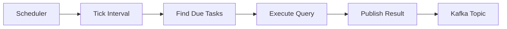

Subscriptions allow you to schedule recurring queries that execute at regular intervals.

## Overview

A subscription consists of:

- **Query** - The SnQL or RPC query to execute
- **Resolution** - How often to execute (minimum 60 seconds)
- **Time Window** - The time range to query each execution
- **Entity** - The data entity to query

Subscriptions are useful for:
- Alert monitoring
- Metric aggregation pipelines
- Scheduled reports
- Real-time dashboards

## Create Subscription

<CodeGroup>
```bash POST /{dataset}/{entity}/subscriptions
curl -X POST http://localhost:1218/events/events/subscriptions \
  -H "Content-Type: application/json" \
  -d '{
    "project_id": 1,
    "query": "MATCH (events) SELECT count() WHERE project_id = 1 AND level = '"'"'error'"'"'",
    "time_window": 300,
    "resolution": 60,
    "tenant_ids": {
      "organization_id": 1,
      "referrer": "subscription_service"
    }
  }'
```

```python Python
import requests

response = requests.post(
    "http://localhost:1218/events/events/subscriptions",
    json={
        "project_id": 1,
        "query": "MATCH (events) SELECT count() WHERE project_id = 1 AND level = 'error'",
        "time_window": 300,  # 5 minutes
        "resolution": 60,    # Every minute
        "tenant_ids": {
            "organization_id": 1,
            "referrer": "subscription_service"
        }
    }
)

subscription_id = response.json()["subscription_id"]
print(f"Created subscription: {subscription_id}")
```
</CodeGroup>

### Request Body

<ParamField path="project_id" type="integer" required>
  Project ID to query
</ParamField>

<ParamField path="query" type="string" required>
  SnQL query to execute on each interval
</ParamField>

<ParamField path="time_window" type="integer" required>
  Time window in seconds (60 to 86400). Each execution queries data from `[now - time_window, now]`
</ParamField>

<ParamField path="resolution" type="integer" required>
  Execution interval in seconds (minimum 60)
</ParamField>

<ParamField path="tenant_ids" type="object" required>
  Tenant identification
</ParamField>

<ParamField path="tenant_ids.organization_id" type="integer" required>
  Organization ID
</ParamField>

<ParamField path="tenant_ids.referrer" type="string">
  Service identifier
</ParamField>

### Response

<ResponseField name="subscription_id" type="string">
  Unique identifier for the subscription in format `{partition}/{uuid}`
</ResponseField>

Example:

```json
{
  "subscription_id": "0/a1b2c3d4-e5f6-7890-abcd-ef1234567890"
}
```

HTTP Status: `202 Accepted`

## Delete Subscription

Delete an existing subscription:

<CodeGroup>
```bash DELETE /{dataset}/{entity}/subscriptions/{partition}/{key}
curl -X DELETE http://localhost:1218/events/events/subscriptions/0/a1b2c3d4-e5f6-7890-abcd-ef1234567890
```

```python Python
import requests

response = requests.delete(
    "http://localhost:1218/events/events/subscriptions/0/a1b2c3d4-e5f6-7890-abcd-ef1234567890"
)

print(response.text)  # "ok"
```
</CodeGroup>

### Path Parameters

<ParamField path="dataset" type="string" required>
  Dataset name (e.g., `events`, `transactions`)
</ParamField>

<ParamField path="entity" type="string" required>
  Entity name (e.g., `events`, `transactions`, `metrics_counters`)
</ParamField>

<ParamField path="partition" type="integer" required>
  Partition ID from subscription_id
</ParamField>

<ParamField path="key" type="string" required>
  UUID from subscription_id
</ParamField>

### Response

```
ok
```

HTTP Status: `202 Accepted`

## Subscription Types

Snuba supports two subscription types:

### SnQL Subscriptions

Standard subscriptions using SnQL queries:

```json
{
  "subscription_type": "snql",
  "query": "MATCH (events) SELECT count() WHERE ..."
}
```

### RPC Subscriptions

Subscriptions using protobuf-based RPC requests:

```json
{
  "subscription_type": "rpc",
  "request_name": "TimeSeriesRequest",
  "request_version": "v1",
  "time_series_request": "<base64-encoded-protobuf>"
}
```

RPC subscriptions support:
- TimeSeries queries
- Expression-based aggregations
- Extrapolation modes

## Subscription Execution

Subscriptions execute on a schedule managed by the subscription scheduler:



### Execution Flow

1. **Scheduler** checks for subscriptions due to execute
2. **Query Builder** constructs query with current time window
3. **Executor** runs query through normal query pipeline
4. **Publisher** sends results to Kafka

### Time Window Behavior

For a subscription with:
- `resolution: 60` (1 minute)
- `time_window: 300` (5 minutes)

At `2024-01-01T12:00:00`, the query executes with:

```sql
WHERE timestamp >= toDateTime('2024-01-01T11:55:00')
  AND timestamp < toDateTime('2024-01-01T12:00:00')
```

At `2024-01-01T12:01:00`, the window shifts:

```sql
WHERE timestamp >= toDateTime('2024-01-01T11:56:00')
  AND timestamp < toDateTime('2024-01-01T12:01:00')
```

## Subscription Data Store

Subscriptions are stored in Redis:

- **Key Pattern**: `snuba-subscriptions:{entity}:{partition}:{uuid}`
- **Partitioning**: By entity topic partition
- **Persistence**: Redis provides durable storage

Implementation: `snuba/subscriptions/store.py`

## Validation

Subscriptions are validated on creation:

### Time Window Validation

- Minimum: 60 seconds (1 minute)
- Maximum: 86400 seconds (24 hours)

### Resolution Validation

- Minimum: 60 seconds

### Query Validation

- Query must be valid SnQL/RPC
- Query executes successfully (test run)
- Entity must support subscriptions

### RPC-Specific Validation

- Exactly one expression required
- No group by clauses
- Extrapolation mode must be specified
- Single project ID only

Source: `snuba/subscriptions/data.py:122`

## Error Handling

### Invalid Subscription Error

```json
{
  "error": {
    "type": "subscription",
    "message": "Time window must be greater than or equal to 1 minute"
  }
}
```

HTTP Status: `400 Bad Request`

### Invalid Dataset/Entity Combination

```json
{
  "error": {
    "type": "subscription",
    "message": "Invalid subscription dataset and entity combination"
  }
}
```

## Subscription Results

Results are published to Kafka topics for consumption by downstream services.

### Result Format

```json
{
  "subscription_id": "0/a1b2c3d4-e5f6-7890-abcd-ef1234567890",
  "timestamp": "2024-01-01T12:00:00",
  "result": {
    "data": [
      {"count": 42}
    ],
    "meta": [
      {"name": "count", "type": "UInt64"}
    ]
  }
}
```

## Use Cases

<AccordionGroup>
  <Accordion title="Error Rate Monitoring">
    Monitor error rates and alert when thresholds are exceeded:
    ```json
    {
      "query": "MATCH (events) SELECT count() WHERE level = 'error'",
      "resolution": 60,
      "time_window": 300
    }
    ```
  </Accordion>

  <Accordion title="Performance Metrics">
    Track p95 latency over time:
    ```json
    {
      "query": "MATCH (transactions) SELECT quantile(0.95)(duration)",
      "resolution": 300,
      "time_window": 3600
    }
    ```
  </Accordion>

  <Accordion title="Volume Tracking">
    Monitor event volume for capacity planning:
    ```json
    {
      "query": "MATCH (events) SELECT count() BY project_id",
      "resolution": 3600,
      "time_window": 3600
    }
    ```
  </Accordion>
</AccordionGroup>

## Implementation Details

Key source files:

- `snuba/web/views.py:519` - Create subscription endpoint
- `snuba/web/views.py:540` - Delete subscription endpoint
- `snuba/subscriptions/subscription.py` - SubscriptionCreator/Deleter
- `snuba/subscriptions/data.py` - SubscriptionData models
- `snuba/subscriptions/scheduler.py` - Subscription scheduler
- `snuba/subscriptions/executor_consumer.py` - Query executor

## Related

<CardGroup cols={2}>
  <Card title="Query API" icon="search" href="/api/query">
    Learn about query execution
  </Card>
  <Card title="Python API" icon="code" href="/api/python/datasets">
    Programmatic subscription management
  </Card>
</CardGroup>