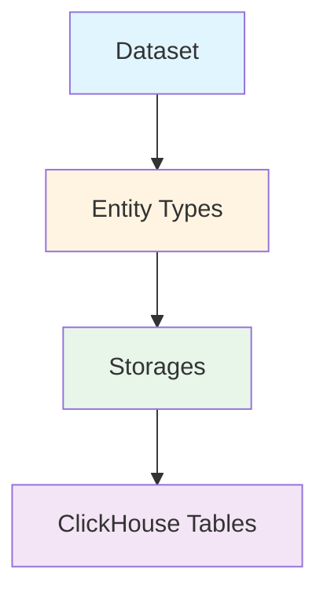

Snuba's data model is divided horizontally into a **logical model** and a **physical model**. This separation allows Snuba to expose a stable interface while performing complex internal optimizations transparently.

## Architecture Overview

The data model consists of three core concepts arranged hierarchically:



<Info>
  The logical model (Datasets and Entities) is what clients see through the query language. The physical model (Storages) maps to actual database tables.
</Info>

## Datasets

A **Dataset** is a namespace over Snuba data. It provides its own schema and is independent from other datasets in both logical and physical models.

### Characteristics

- **Isolated** - No relationships between different datasets
- **Self-contained** - Each has its own schema and configuration
- **Query scoped** - Every query targets exactly one dataset

### Examples

- `discover` - Events and transactions for the Discover product
- `outcomes` - Billing and quota data
- `sessions` - Release health metrics
- `metrics` - Custom metrics aggregations

```python
# From snuba/datasets/dataset.py
class Dataset:
    """
    A dataset represents a data model we can run a Snuba Query on.
    A data model provides a logical schema of a graph of entities.
    """
    
    def __init__(self, *, all_entities: Sequence[EntityKey]) -> None:
        self.__all_entities = all_entities
    
    def get_all_entities(self) -> Sequence[Entity]:
        return [get_entity(entity_key) for entity_key in self.__all_entities]
```

## Entities and Entity Types

The fundamental building block of the logical data model is the **Entity**. An entity represents an instance of an abstract concept (like a transaction or an error).

### Entity vs Entity Type

- **Entity** - A single instance (e.g., one error event)
- **Entity Type** - The class of entities (e.g., all Errors or all Transactions)

<Note>
  In practice, an Entity corresponds to a row in a database table. The Entity Type defines the schema for all such rows.
</Note>

### Entity Schema

Each Entity Type has:

- **Column set** - Fields with abstract data types
- **Validators** - Query validation rules
- **Processors** - Logical query transformations
- **Relationships** - Joins to other entity types

```python
# From snuba/datasets/entity.py
class Entity:
    """
    The Entity has access to multiple Storage objects, which represent 
    the physical data model.
    """
    
    def __init__(
        self,
        *,
        storages: Sequence[EntityStorageConnection],
        abstract_column_set: ColumnSet,
        join_relationships: Mapping[str, JoinRelationship],
        validators: Optional[Sequence[QueryValidator]],
        required_time_column: Optional[str],
    ) -> None:
        self.__storages = storages
        self.__data_model = ColumnSet(abstract_column_set.columns)
        self.__join_relationships = join_relationships
        self.__validators = validators
```

### Entity Relationships

Entity Types within a Dataset can be related in two ways:

#### 1. Entity Set Relationship (Foreign Keys)

Mimics foreign key relationships for joins between Entity Types:

- Supports **one-to-one** and **one-to-many** relationships
- Enables JOIN queries across entities
- Example: Errors can join with GroupedMessage

#### 2. Inheritance Relationship (Subtyping)

Mimics nominal subtyping where entity types share a parent:

- **Subtypes inherit** schema from parent type
- **Parent represents union** of all subtypes
- **Queries** can target parent to query all subtypes
- Example: Events entity is parent of Errors and Transactions

<Accordion title="Example: Discover Dataset with Inheritance">
```
Events (Parent Entity Type)
├── Errors (Child Entity Type)
│   └── errors_storage
└── Transactions (Child Entity Type)
    └── transactions_storage

# Querying Events returns union of Errors and Transactions
# Only common fields between both types are available
```
</Accordion>

### Entity Type and Consistency

The Entity Type is the **largest unit** where Snuba can provide strong consistency guarantees:

- Possible to query with **Serializable Consistency**
- Does not extend to multi-entity queries
- Subscription queries work on one Entity Type at a time

<Warning>
  The actual unit of consistency may be smaller based on ingestion topic partitioning (e.g., by project_id). The Entity Type is the maximum boundary.
</Warning>

## Storages

Storages represent the **physical data model** - they map directly to ClickHouse database concepts.

### Storage Characteristics

- **Physical mapping** - Each storage is a ClickHouse table or materialized view
- **Entity relationship** - Each storage backs exactly one entity type
- **Schema definition** - Reflects physical database schema
- **DDL generation** - Provides details to generate CREATE TABLE statements

```python
# From snuba/datasets/storage.py
class Storage(ABC):
    """
    Storage is an abstraction that represents a DB object that stores 
    data and has a schema.
    """
    
    def __init__(
        self,
        storage_set_key: StorageSetKey,
        schema: Schema,
        readiness_state: ReadinessState,
        required_time_column: Optional[str] = None,
    ):
        self.__storage_set_key = storage_set_key
        self.__schema = schema
        self.__readiness_state = readiness_state
```

### Storage Types

#### ReadableStorage

Anything that can be queried:

- ClickHouse tables
- ClickHouse views
- Materialized views
- Provides query processors for optimization

#### WritableStorage

Anything that can be written to:

- ClickHouse tables (not views)
- Provides table writer for inserts
- Connected to Kafka stream loader

```python
class WritableTableStorage(ReadableTableStorage, WritableStorage):
    def __init__(
        self,
        storage_key: StorageKey,
        schema: Schema,
        query_processors: Sequence[ClickhouseQueryProcessor],
        stream_loader: KafkaStreamLoader,
        replacer_processor: Optional[ReplacerProcessor] = None,
    ) -> None:
        # Combines read and write capabilities
        self.__table_writer = TableWriter(
            storage_set=storage_set_key,
            write_schema=schema,
            stream_loader=stream_loader,
        )
```

### Storage-Entity Mapping Rules

1. **Readable Storages**: Each entity type must be backed by at least one readable storage (can have multiple for optimization)
2. **Writable Storage**: Each entity type must have exactly one writable storage for data ingestion
3. **Exclusive Relationship**: Each storage backs exclusively one entity type

## Data Model Examples

### Single Entity Dataset

Simple dataset with one entity type and multiple storages for performance:

```yaml
Dataset: Outcomes
└── Entity Type: Outcome
    ├── Storage: outcomes_raw (writable)
    │   └── Table: outcomes_raw_local
    └── Storage: outcomes_hourly (readable)
        └── Materialized View: outcomes_mv_hourly
```

**Use case**: Raw storage for complete data, materialized view for fast aggregations

### Multi-Entity Dataset with Inheritance

Discover dataset demonstrating inheritance:

```yaml
Dataset: Discover
├── Entity Type: Events (parent)
│   └── Storage: events_merge
│       └── Merge Table: events_dist (union view)
├── Entity Type: Errors (child of Events)
│   ├── Storage: errors (writable)
│   │   └── Table: errors_local/errors_dist
│   └── Storage: errors_ro (readable)
│       └── Table: errors_ro_local/errors_ro_dist
└── Entity Type: Transactions (child of Events)
    └── Storage: transactions (writable)
        └── Table: transactions_local/transactions_dist
```

**Features**:
- Errors has two storages: main table and read-only replicas
- Events entity provides unified view over both
- Queries to Events return union of Errors and Transactions

### Dataset with Joins

Dataset supporting joins between entities:

```yaml
Dataset: Events
├── Entity Type: Errors
│   └── Storage: errors
│       └── Table: errors_local
├── Entity Type: GroupedMessage
│   └── Storage: groupedmessage  
│       └── Table: groupedmessage_local
└── Entity Type: GroupAssignee
    └── Storage: groupassignee
        └── Table: groupassignee_local

# Relationship: Errors LEFT JOIN GroupedMessage ON group_id
# Relationship: Errors LEFT JOIN GroupAssignee ON group_id
```

## Configuration Example

Storage configuration from YAML:

```yaml
# From snuba/datasets/configuration/events/storages/errors.yaml
version: v1
kind: writable_storage
name: errors
storage:
  key: errors
  set_key: events
schema:
  columns:
    - { name: project_id, type: UInt, args: { size: 64 } }
    - { name: timestamp, type: DateTime }
    - { name: event_id, type: UUID }
    - { name: platform, type: String }
  local_table_name: errors_local
  dist_table_name: errors_dist
stream_loader:
  processor: ErrorsProcessor
  default_topic: events
  commit_log_topic: snuba-commit-log
```

## Key Takeaways

<CardGroup cols={2}>
  <Card title="Logical Abstraction" icon="layer-group">
    Datasets and Entities provide stable client-facing interface
  </Card>
  <Card title="Physical Flexibility" icon="database">
    Storages enable internal optimization without breaking API
  </Card>
  <Card title="Multiple Storages" icon="clone">
    Pre-aggregations and read replicas improve performance
  </Card>
  <Card title="Consistency Boundaries" icon="shield-halved">
    Entity Type defines maximum consistency scope
  </Card>
</CardGroup>

## Related Topics

- [Storage](/architecture/storage) - ClickHouse storage implementation details
- [Query Processing](/architecture/query-processing) - How queries traverse the data model
- [Slicing](/architecture/slicing) - Multi-tenancy and data partitioning
