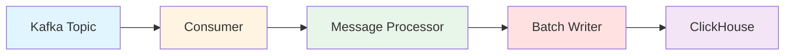

Snuba ingests data through a Kafka-based pipeline that processes messages in batches and writes them to ClickHouse. This architecture enables high throughput while maintaining data quality and consistency guarantees.

## Ingestion Overview

<Note>
  Snuba does not provide a direct API endpoint to insert rows (except in debug mode). All production data flows through Kafka.
</Note>

The ingestion pipeline consists of four main stages:



1. **Kafka Topics** - Events arrive from upstream producers (e.g., Sentry)
2. **Consumers** - Read messages in batches from Kafka
3. **Message Processors** - Transform Kafka messages to ClickHouse rows
4. **Batch Writers** - Write batched rows to ClickHouse tables

## Consumer Architecture

Snuba provides two consumer implementations:

<CardGroup cols={2}>
  <Card title="Python Consumer" icon="python">
    Original implementation with multiprocessing
  </Card>
  <Card title="Rust Consumer" icon="rust">
    High-performance implementation for throughput-critical datasets
  </Card>
</CardGroup>

### Python Consumer

The original consumer implementation:

```bash
snuba consumer --storage=errors --consumer-group=snuba-consumers
```

**Characteristics**:
- Message processors written in Python
- Uses multiprocessing to bypass GIL
- Easier to develop and debug
- Suitable for most datasets

**Architecture**:
```python
# Uses arroyo library for Kafka consumption
# Multiprocessing for parallel message processing
# Batches writes to ClickHouse
```

### Rust Consumer

High-performance consumer for high-throughput datasets:

```bash
snuba rust-consumer --storage=errors --consumer-group=snuba-consumers --use-rust-processor
```

**Characteristics**:
- Message processors written in Rust
- Native concurrency with tokio runtime
- 10-20x faster than Python consumer
- Required for high-volume datasets

**Modes**:

#### Pure Rust (`--use-rust-processor`)
- Rust message processor implementation
- Best performance
- Requires porting processor to Rust

#### Hybrid (`--use-python-processor`)
- Uses Python processor from Rust consumer
- Performance similar to Python consumer
- No porting required

<Info>
  Even with pure Rust consumers, Python message processors must exist for test endpoints. Use `RustCompatProcessor` to delegate to Rust.
</Info>

## Message Processors

Message processors transform Kafka messages into ClickHouse rows:

```python
# From snuba/processor.py
class MessageProcessor(ABC):
    """Processes a message from Kafka into ClickHouse rows"""
    
    @abstractmethod
    def process_message(
        self,
        message: Mapping[str, Any],
        metadata: KafkaMessageMetadata,
    ) -> Union[InsertBatch, ReplacementBatch, None]:
        """
        Convert a message from Kafka into rows to insert into ClickHouse
        
        Returns:
            InsertBatch: Rows to insert
            ReplacementBatch: Mutation operations
            None: Skip this message
        """
        raise NotImplementedError
```

### Message Processing Flow

```python
# From snuba/consumers/consumer.py
def process_message(
    processor: MessageProcessor,
    consumer_group: str,
    snuba_logical_topic: SnubaTopic,
    enforce_schema: bool,
    message: Message[KafkaPayload],
) -> Union[None, BytesInsertBatch, ReplacementBatch]:
    # 1. Decode message with JSON codec
    codec = get_json_codec(snuba_logical_topic)
    decoded = codec.decode(message.payload.value)
    
    # 2. Validate schema (sampling-based)
    if should_validate:
        codec.validate(decoded)
    
    # 3. Process message
    result = processor.process_message(
        decoded,
        KafkaMessageMetadata(
            message.value.offset,
            message.value.partition.index,
            message.value.timestamp,
        ),
    )
    
    # 4. Encode rows as bytes
    if isinstance(result, InsertBatch):
        return BytesInsertBatch(
            [json_row_encoder.encode(row) for row in result.rows],
            result.origin_timestamp,
        )
    return result
```

### Example: Errors Processor

Processors extract fields from messages and map to table schema:

```python
class ErrorsProcessor(MessageProcessor):
    def process_message(
        self, message: Mapping[str, Any], metadata: KafkaMessageMetadata
    ) -> InsertBatch:
        # Extract event data
        event_id = message["event_id"]
        project_id = message["project_id"]
        timestamp = datetime.fromisoformat(message["timestamp"])
        
        # Extract tags
        tags_key = []
        tags_value = []
        for key, value in message.get("tags", {}).items():
            tags_key.append(key)
            tags_value.append(str(value))
        
        # Build row matching ClickHouse schema
        row = {
            "event_id": event_id,
            "project_id": project_id,
            "timestamp": timestamp,
            "platform": message.get("platform", ""),
            "message": message.get("message", ""),
            "tags.key": tags_key,
            "tags.value": tags_value,
            # ... more fields
        }
        
        return InsertBatch([row], timestamp)
```

## Batch Writing

Processed messages are batched before writing to ClickHouse:

```python
# From snuba/consumers/consumer.py
class InsertBatchWriter:
    """Accumulates messages and writes batch to ClickHouse"""
    
    def __init__(self, writer: BatchWriter[JSONRow], metrics: MetricsBackend):
        self.__writer = writer
        self.__messages: List[Message[BytesInsertBatch]] = []
    
    def submit(self, message: Message[BytesInsertBatch]) -> None:
        """Add message to batch"""
        self.__messages.append(message)
    
    def close(self) -> None:
        """Write entire batch to ClickHouse"""
        if not self.__messages:
            return
        
        # Flatten all rows from all messages
        all_rows = itertools.chain.from_iterable(
            message.payload.rows for message in self.__messages
        )
        
        # Single write to ClickHouse
        self.__writer.write(all_rows)
        
        # Record metrics
        self.__metrics.increment(
            "batch_write_msgs",
            sum(len(msg.payload.rows) for msg in self.__messages)
        )
```

### Batch Parameters

**Batch Size**: Controlled by arroyo configuration
- Larger batches = better throughput
- Smaller batches = lower latency
- Typical: 100-10,000 messages per batch

**Flush Interval**: Maximum time to wait before writing
- Ensures bounded latency
- Typical: 1-10 seconds

## Kafka Topics

Snuba consumes from various Kafka topics:

### Main Topics

```python
# Topic definitions in stream_loader configuration
stream_loader:
  processor: ErrorsProcessor
  default_topic: events              # Main data topic
  replacement_topic: event-replacements  # Mutation operations
  commit_log_topic: snuba-commit-log    # Offset tracking
```

#### Default Topic

Primary data stream:
- Contains events to be inserted
- Example: `events`, `transactions`, `outcomes`
- Partitioned by project_id for ordering

#### Replacement Topic

Mutation operations:
- Error merge/unmerge operations
- Group ID updates
- Deletion requests

#### Commit Log Topic

Offset tracking for subscriptions:
- Produced to after batch commit
- Consumed by subscription processor
- Enables synchronized queries

### Topic Partitioning

<Warning>
  Topics must be partitioned by project_id to ensure events from the same project are processed in order. This is critical for replacements and subscriptions.
</Warning>

Example partitioning logic:
```python
# In upstream producer
partition_key = str(message["project_id"])
producer.produce(topic, value=message, key=partition_key)
```

## Consumer Groups

Kafka consumer groups enable parallel processing:

```bash
# Multiple consumers in same group share partitions
snuba consumer --storage=errors --consumer-group=snuba-consumers
```

**Parallelism**:
- Each partition assigned to exactly one consumer in group
- Maximum parallelism = number of partitions
- Consumers automatically rebalance on failure

## Consistency Guarantees

### At-Least-Once Delivery

Consumers guarantee each message is processed at least once:

1. Read batch from Kafka
2. Process messages
3. Write to ClickHouse
4. Commit offsets to Kafka

<Info>
  If consumer crashes between steps 3 and 4, messages are reprocessed. ClickHouse deduplication handles duplicates.
</Info>

### Exactly-Once Semantics

Achieved through combination:

1. **At-least-once delivery** from consumer
2. **ReplacingMergeTree** deduplication in ClickHouse
3. **Deterministic primary keys** (e.g., event_id)

Result: Eventual exactly-once semantics with eventual consistency

### Sequential Consistency (Optional)

For features requiring strong consistency:

1. Consumer writes to specific ClickHouse replica
2. Query forced to same replica
3. FINAL modifier ensures deduplication

Result: Sequential consistency at cost of performance

## Commit Log

After writing batch, consumer produces to commit log:

```python
class ProcessedMessageBatchWriter:
    def close(self) -> None:
        # Write to ClickHouse
        self.__insert_batch_writer.close()
        
        # Produce commit log messages
        if self.__commit_log_config:
            for partition, (offset, timestamp) in self.__offsets_to_produce.items():
                payload = commit_codec.encode(
                    CommitLogCommit(
                        self.__commit_log_config.group_id,
                        partition,
                        offset,
                        timestamp,
                        received_p99,  # Latency tracking
                    )
                )
                self.__commit_log_config.producer.produce(
                    self.__commit_log_config.topic.name,
                    key=payload.key,
                    value=payload.value,
                )
```

**Purpose**:
- Subscription consumers track main consumer progress
- Ensures subscriptions don't query uncommitted data
- Enables synchronized processing

## Error Handling

### Invalid Messages

Messages that fail processing:

```python
try:
    result = processor.process_message(decoded, metadata)
except Exception as err:
    # Log error with Sentry
    logger.warning(err, exc_info=True)
    
    # Mark message as invalid
    raise InvalidMessage(partition, offset) from err
```

**Options**:
- **Skip**: Continue processing (default)
- **DLQ**: Send to dead letter queue
- **Fail**: Stop consumer (for critical errors)

### Schema Validation

Sampling-based validation:

```python
# Validate subset of messages
validate_sample_rate = state.get_float_config(
    f"validate_schema_{topic}", 1.0
)

if random.random() < validate_sample_rate:
    try:
        codec.validate(decoded)
    except Exception as err:
        metrics.increment("schema_validation.failed")
        if enforce_schema:
            raise
```

## Replacements

Some storages support mutations via replacements:

```python
class ReplacementBatchWriter:
    """Produces replacement operations to Kafka"""
    
    def close(self) -> None:
        for message in self.__messages:
            batch = message.payload
            for value in batch.values:
                # Produce to replacements topic
                self.__producer.produce(
                    self.__topic.name,
                    key=batch.key,
                    value=json.dumps(value),
                )
```

**Replacement Operations**:
- Merge error groups
- Unmerge error groups  
- Update group IDs
- Mark events as deleted

**Replacement Consumer**:
- Separate consumer reads replacement topic
- Executes ClickHouse ALTER TABLE mutations
- Updates rows in place

<Warning>
  Replacements are expensive operations. ClickHouse mutations rewrite entire data parts.
</Warning>

## Multi-Storage Consumers

Some consumers write to multiple storages:

```python
class MultistorageCollector:
    """Routes processed messages to multiple storage writers"""
    
    def submit(
        self,
        message: Message[Sequence[Tuple[StorageKey, BytesInsertBatch]]],
    ) -> None:
        # Each message can target multiple storages
        for storage_key, payload in message.payload:
            writer_message = message.replace(payload)
            self.__steps[storage_key].submit(writer_message)
```

**Use case**: Single Kafka topic feeds multiple ClickHouse tables

## Performance Tuning

### Consumer Configuration

```bash
snuba consumer \
  --storage=errors \
  --consumer-group=snuba-consumers \
  --max-batch-size=10000 \
  --max-batch-time-ms=5000 \
  --processes=4
```

### Batch Size

- **Larger batches**: Better ClickHouse throughput
- **Smaller batches**: Lower end-to-end latency
- **Recommendation**: Start with 1000-5000

### Parallelism

- **More partitions**: Higher parallelism
- **More consumers**: Process partitions in parallel
- **Bottleneck**: ClickHouse write capacity

### Memory Usage

- Monitor heap size with multiprocessing
- Rust consumer has better memory efficiency
- Consider batch size impact on memory

## Monitoring

Key metrics to track:

```python
# Consumer lag
metrics.gauge("consumer_lag", lag)

# Processing latency
metrics.timing("latency_ms", latency)

# Write throughput
metrics.increment("batch_write_msgs", row_count)

# Errors
metrics.increment("invalid_message")
metrics.increment("schema_validation.failed")
```

## Related Topics

- [Storage](/architecture/storage) - Where ingested data is written
- [Data Model](/architecture/data-model) - Storage schema definitions
- [Slicing](/architecture/slicing) - Multi-tenant ingestion configuration
