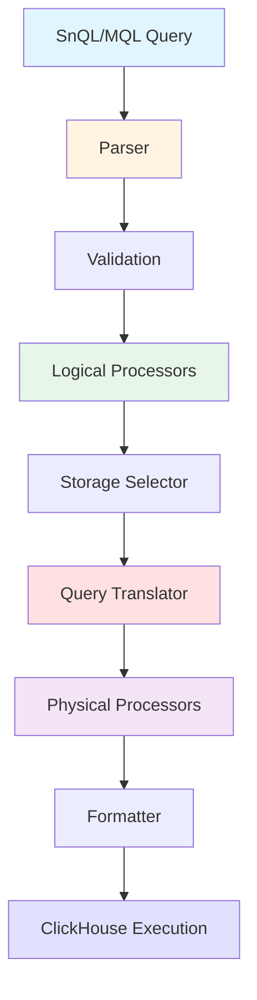
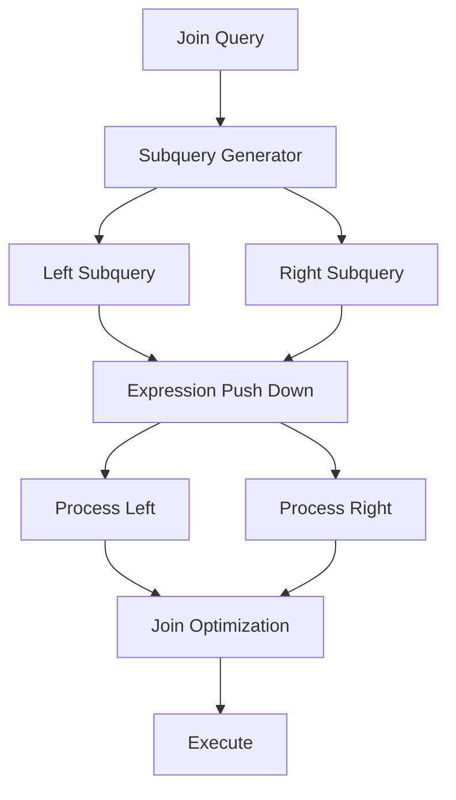

Snuba's query processing pipeline transforms high-level queries in SnQL or MQL into optimized ClickHouse SQL. The pipeline consists of multiple stages that validate, transform, and optimize queries before execution.

## Pipeline Overview

The query processing pipeline has two main sections:

<CardGroup cols={2}>
  <Card title="Logical Processing" icon="diagram-project">
    Product-level transformations and validation
  </Card>
  <Card title="Physical Processing" icon="gears">
    Database-specific optimization and execution
  </Card>
</CardGroup>



## Query Languages

Snuba supports two query languages:

### SnQL (Snuba Query Language)

SQL-like declarative language:

```sql
-- SnQL Example
MATCH (events)
SELECT
    project_id,
    count() AS event_count,
    uniq(user) AS unique_users
BY project_id
WHERE
    timestamp >= toDateTime('2024-01-01 00:00:00')
    AND timestamp < toDateTime('2024-01-02 00:00:00')
    AND project_id IN array(1, 2, 3)
ORDER BY event_count DESC
LIMIT 100
```

### MQL (Metrics Query Language)

Specialized for metrics queries:

```python
# MQL Example (JSON format)
{
  "mql": "sum(d:transactions/duration@millisecond)",
  "start": "2024-01-01T00:00:00Z",
  "end": "2024-01-02T00:00:00Z",
  "rollup": {
    "interval": 60,
    "granularity": 60
  },
  "scope": {
    "org_ids": [1],
    "project_ids": [1, 2, 3]
  }
}
```

## Stage 1: Parsing

Parsers convert query strings into Abstract Syntax Trees (AST):

```python
# From snuba/query/snql/parser.py
def parse_snql_query(query_body: str, dataset: Dataset) -> Query:
    """
    Parse SnQL query string into Query AST
    """
    # Tokenize query string
    tokens = tokenize(query_body)
    
    # Build AST from tokens
    query = build_query_ast(tokens)
    
    # Attach dataset context
    query.set_from_clause(dataset)
    
    return query
```

### Query AST Structure

The AST represents queries as structured objects:

```python
# Simplified Query structure
class Query:
    selected_columns: List[SelectedExpression]
    condition: Optional[Expression]
    groupby: Optional[List[Expression]]
    having: Optional[Expression]
    order_by: Optional[List[OrderBy]]
    limitby: Optional[LimitBy]
    limit: Optional[int]
    offset: Optional[int]
```

<Note>
  Both SnQL and legacy JSON parsers produce the same Query AST, allowing unified processing afterward.
</Note>

## Stage 2: Validation

Validation ensures queries are correct before processing:

### General Validation

Applied to all queries:

```python
# Function signature validation
validator = FunctionSignatureValidator()
validator.validate(query)

# Check for:
# - Valid function calls
# - Correct argument types
# - No alias shadowing
# - No ambiguous references
```

### Entity-Specific Validation

Each entity defines required conditions:

```yaml
# From entity configuration
mandatory_condition_checkers:
  - condition: ProjectIdEnforcer  # Requires project_id filter
  - condition: TimeRangeEnforcer  # Requires timestamp range
```

Example enforcement:

```python
class ProjectIdEnforcer(ConditionChecker):
    """Ensures project_id condition exists"""
    
    def check(self, query: Query) -> bool:
        # Search for project_id in WHERE clause
        return has_condition(query, "project_id")
```

<Warning>
  Queries without project_id or time range filters will be rejected. These conditions are critical for query performance and multi-tenancy.
</Warning>

## Stage 3: Logical Query Processors

Logical processors apply product-level transformations:

```python
# From snuba/query/processors/logical.py
class LogicalQueryProcessor(ABC):
    """Transform logical query in-place"""
    
    @abstractmethod
    def process_query(self, query: Query, settings: QuerySettings) -> None:
        raise NotImplementedError
```

### Example Processors

#### Time Series Processor

Buckets results into time intervals:

```python
class TimeSeriesProcessor(LogicalQueryProcessor):
    """Adds time bucketing to queries"""
    
    def process_query(self, query: Query, settings: QuerySettings) -> None:
        # Add toStartOfInterval(timestamp, INTERVAL 60 second)
        time_column = query.get_time_column()
        granularity = settings.get_granularity()
        
        bucketed_time = FunctionCall(
            None,
            "toStartOfInterval",
            (time_column, IntervalLiteral(granularity, "second")),
        )
        
        # Add to SELECT and GROUP BY
        query.add_selected_expression("time", bucketed_time)
        query.add_groupby(bucketed_time)
```

#### Custom Functions

Expand domain-specific functions:

```python
# Apdex function expansion
# Input:  apdex(duration, 300)
# Output: divide(plus(
#           countIf(less(duration, 300)),
#           divide(countIf(lessOrEquals(duration, 1200)), 2)
#         ), count())

class PerformanceExpressionsProcessor(LogicalQueryProcessor):
    def process_query(self, query: Query, settings: QuerySettings) -> None:
        # Find apdex() function calls
        # Replace with expanded expression
        pass
```

### Processor Properties

- **Stateless**: Don't depend on external state
- **Independent**: Don't depend on other processors
- **In-place**: Modify query directly
- **Sequential**: Applied in defined order

## Stage 4: Storage Selection

Choose optimal storage for query execution:

```python
class StorageSelector(ABC):
    """Select storage based on query characteristics"""
    
    @abstractmethod
    def select_storage(
        self, query: Query, settings: QuerySettings
    ) -> StorageKey:
        raise NotImplementedError
```

### Selection Strategies

#### Consistent Query Routing

Route queries to specific replicas:

```python
class ConsistentStorageSelector(StorageSelector):
    """Route to replica where data is written"""
    
    def select_storage(self, query: Query, settings: QuerySettings) -> StorageKey:
        if settings.get_consistent():
            # Route to main table for consistency
            return StorageKey("errors")
        else:
            # Route to read replica for performance
            return StorageKey("errors_ro")
```

#### Aggregation Optimization

Select pre-aggregated views:

```python
class AggregationStorageSelector(StorageSelector):
    """Use materialized views when possible"""
    
    def select_storage(self, query: Query, settings: QuerySettings) -> StorageKey:
        if can_use_hourly_rollup(query):
            # Use pre-aggregated hourly data
            return StorageKey("outcomes_hourly")
        else:
            # Use raw data
            return StorageKey("outcomes_raw")
```

## Stage 5: Query Translation

Translate logical query to physical schema:

### Translation Rules

Map logical columns to physical columns:

```python
# Example: Tag subscriptable expression translation
# Logical:  tags[environment]
# Physical: tags.value[indexOf(tags.key, 'environment')]

class TagsTranslationRule(TranslationRule):
    def translate(self, expr: SubscriptableReference) -> Expression:
        if expr.column.column_name == "tags":
            return FunctionCall(
                None,
                "arrayElement",
                (
                    Column(None, None, "tags.value"),
                    FunctionCall(
                        None,
                        "indexOf",
                        (
                            Column(None, None, "tags.key"),
                            Literal(None, expr.key.value),
                        ),
                    ),
                ),
            )
```

### Translation Mappers

Entities define translation rules:

```python
# From entity configuration
translation_mappers = TranslationMappers(
    columns=[
        ColumnToColumn(None, "project_id", None, "project_id"),
        ColumnToColumn(None, "timestamp", None, "timestamp"),
    ],
    subscriptables=[
        SubscriptableMapper(None, "tags", None, "tags"),
    ],
    functions=[
        FunctionNameMapper("uniq", "uniqCombined64"),
    ],
)
```

## Stage 6: Physical Query Processors

Optimize queries for ClickHouse execution:

```python
class ClickhouseQueryProcessor(ABC):
    """Transform physical query for optimization"""
    
    @abstractmethod  
    def process_query(
        self, query: Query, settings: QuerySettings
    ) -> None:
        raise NotImplementedError
```

### Example Optimizations

#### Mapping Optimizer

Use hash map indexes for tag queries:

```python
# From snuba/query/processors/physical/mapping_optimizer.py
class MappingOptimizer(ClickhouseQueryProcessor):
    """
    Optimize equality conditions on tags using bloom filter index
    
    Before: tags.value[indexOf(tags.key, 'foo')] = 'bar'
    After:  has(_tags_hash_map, cityHash64('foo=bar'))
    """
    
    def process_query(self, query: Query, settings: QuerySettings) -> None:
        # Find tag equality conditions
        # Replace with hash map lookup
        pass
```

#### PREWHERE Processor

Move selective filters to PREWHERE:

```python
class PrewhereProcessor(ClickhouseQueryProcessor):
    """
    Move highly selective conditions to PREWHERE clause
    ClickHouse evaluates PREWHERE before reading all columns
    """
    
    prewhere_candidates = [
        "event_id",    # UUID lookups
        "trace_id",    # Trace queries
        "project_id",  # Project filters
    ]
    
    def process_query(self, query: Query, settings: QuerySettings) -> None:
        # Extract candidate conditions from WHERE
        # Move to PREWHERE clause
        pass
```

#### Array Join Optimizer

Optimize nested column access:

```python
# Optimize queries on nested columns
# Use arrayExists instead of ARRAY JOIN when possible
```

<Info>
  Physical processors are where most query optimization happens. They leverage ClickHouse-specific features like PREWHERE, bloom filters, and skip indexes.
</Info>

## Stage 7: Query Formatting

Generate ClickHouse SQL:

```python
class ClickhouseQueryFormatter:
    """Format query AST into ClickHouse SQL string"""
    
    def format(self, query: Query) -> str:
        # Generate SELECT clause
        select_clause = self._format_select(query.selected_columns)
        
        # Generate FROM clause  
        from_clause = self._format_from(query.from_clause)
        
        # Generate WHERE/PREWHERE
        where_clause = self._format_where(query.condition)
        prewhere_clause = self._format_prewhere(query.prewhere)
        
        # Generate GROUP BY
        groupby_clause = self._format_groupby(query.groupby)
        
        # Combine into SQL
        return f"""
            SELECT {select_clause}
            FROM {from_clause}
            {prewhere_clause}
            {where_clause}
            {groupby_clause}
        """
```

### Example Output

```sql
SELECT
    project_id,
    count() AS event_count,
    uniqCombined64(user) AS unique_users
FROM errors_dist
PREWHERE 
    project_id IN (1, 2, 3)
WHERE
    timestamp >= toDateTime('2024-01-01 00:00:00')
    AND timestamp < toDateTime('2024-01-02 00:00:00')
    AND has(_tags_hash_map, cityHash64('environment=production'))
GROUP BY project_id
ORDER BY event_count DESC
LIMIT 100
```

## Stage 8: Execution

Execute query on ClickHouse:

```python
# From snuba/reader.py
class NativeDriverReader(Reader):
    """Execute queries on ClickHouse via native protocol"""
    
    def execute(
        self,
        query: Query,
        settings: QuerySettings,
    ) -> QueryResult:
        # Format query to SQL
        sql = self._formatter.format(query)
        
        # Add ClickHouse settings
        clickhouse_settings = {
            "max_execution_time": settings.get_timeout(),
            "max_threads": settings.get_max_threads(),
        }
        
        # Execute on cluster
        result = self._client.execute(
            sql,
            settings=clickhouse_settings,
        )
        
        return QueryResult(
            results=result.results,
            meta=result.meta,
        )
```

## Composite Query Processing

Join queries require special handling:



### Join Processing Steps

1. **Subquery Generation**: Split join into subqueries
2. **Expression Push Down**: Move filters into subqueries
3. **Independent Processing**: Process each subquery through full pipeline
4. **Join Optimization**: Apply join-specific optimizations (e.g., semi-join)

<Warning>
  ClickHouse join engine doesn't automatically push down expressions. Snuba must do this to avoid inefficient joins.
</Warning>

## Query Pipeline Architecture

The pipeline is implemented using composable stages:

```python
# From snuba/pipeline/query_pipeline.py
class QueryPipelineStage(Generic[Tin, Tout]):
    """Single stage in query pipeline"""
    
    @abstractmethod
    def _process_data(self, input: QueryPipelineData[Tin]) -> Tout:
        raise NotImplementedError
    
    def execute(self, input: QueryPipelineResult[Tin]) -> QueryPipelineResult[Tout]:
        # Handle errors from previous stages
        if input.error:
            return self._process_error(input)
        
        try:
            # Process this stage
            return QueryPipelineResult(
                data=self._process_data(input.as_data()),
                error=None,
                query_settings=input.query_settings,
            )
        except Exception as e:
            # Capture errors for next stage
            return QueryPipelineResult(
                data=None,
                error=e,
                query_settings=input.query_settings,
            )
```

## Performance Considerations

### Query Optimization Tips

1. **Always include project_id**: Required and highly selective
2. **Use time ranges**: Enables partition pruning
3. **Leverage PREWHERE**: Put selective filters on indexed columns
4. **Limit result sets**: Use LIMIT to bound resource usage
5. **Use sampling**: SAMPLE clause for approximate results

### Common Issues

<Accordion title="Slow Tag Queries">
  Use promoted tags (mapped to real columns) instead of accessing nested tags structure. Configure in mapping_specs.
</Accordion>

<Accordion title="High Memory Usage">
  Reduce GROUP BY cardinality. ClickHouse materializes group keys in memory. Consider pre-aggregation.
</Accordion>

<Accordion title="Query Timeouts">
  Check for missing indexes, overly broad time ranges, or high cardinality GROUP BY. Use query stats to identify bottlenecks.
</Accordion>

## Related Topics

- [Data Model](/architecture/data-model) - Understanding entity schemas
- [Storage](/architecture/storage) - ClickHouse storage details
- [Query Reference](/query/snql) - SnQL language documentation
