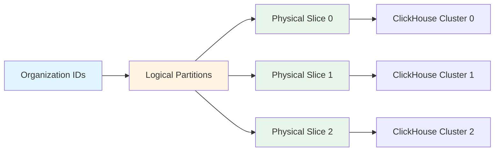

<Warning>
  This feature is under active development and is subject to change. The current implementation supports the architecture described here, but additional features are still being added.
</Warning>

Dataset slicing enables Snuba to partition data across multiple physical resources (ClickHouse clusters, Kafka clusters, Redis instances) while maintaining the same logical schema. This provides isolation, scalability, and performance benefits for multi-tenant deployments.

## Slicing Overview

Slicing maps **logical partitions** to **physical slices**:



**Key Concepts**:

- **Logical Partition**: Identifier for a tenant (e.g., organization_id)
- **Physical Slice**: Actual infrastructure resources (ClickHouse cluster, Kafka topics)
- **Slice ID**: Numeric identifier for a physical slice (0, 1, 2, ...)

## Why Slicing?

Slicing provides several benefits:

<CardGroup cols={2}>
  <Card title="Tenant Isolation" icon="shield">
    Separate infrastructure prevents noisy neighbors
  </Card>
  <Card title="Horizontal Scaling" icon="up-right-and-down-left-from-center">
    Add slices to scale capacity independently
  </Card>
  <Card title="Performance Isolation" icon="gauge-high">
    High-volume tenants don't impact others
  </Card>
  <Card title="Operational Flexibility" icon="screwdriver-wrench">
    Migrate, upgrade, or debug individual slices
  </Card>
</CardGroup>

## Architecture Components

### Logical Partition Mapping

Maps organization IDs to slice IDs:

```python
# In settings.py
LOGICAL_PARTITION_MAPPING = {
    StorageSetKey.METRICS: {
        1: 0,     # Org 1 -> Slice 0
        2: 0,     # Org 2 -> Slice 0  
        3: 1,     # Org 3 -> Slice 1
        4: 1,     # Org 4 -> Slice 1
        5: 2,     # Org 5 -> Slice 2
        # ...
    }
}
```

<Note>
  Every logical partition must be assigned to a slice. Valid slice IDs are in range [0, slice_count).
</Note>

### Sliced Storage Sets

Defines which storage sets support slicing:

```python
# In settings.py
SLICED_STORAGE_SETS = {
    StorageSetKey.METRICS: 3,           # 3 slices (0, 1, 2)
    StorageSetKey.GENERIC_METRICS: 2,   # 2 slices (0, 1)
}
```

### Sliced ClickHouse Clusters

Maps (storage_set, slice_id) pairs to ClickHouse clusters:

```python
# In settings.py
SLICED_CLUSTERS = [
    {
        "host": "clickhouse-slice-0",
        "port": 9000,
        "http_port": 8123,
        "database": "default",
        "storage_set_slices": [
            ("metrics", 0),
            ("generic_metrics", 0),
        ],
        "single_node": False,
        "cluster_name": "metrics_slice_0",
    },
    {
        "host": "clickhouse-slice-1",
        "port": 9000,
        "http_port": 8123,
        "database": "default",
        "storage_set_slices": [
            ("metrics", 1),
            ("generic_metrics", 1),
        ],
        "single_node": False,
        "cluster_name": "metrics_slice_1",
    },
]
```

### Sliced Kafka Topics

Maps (logical_topic, slice_id) to physical topics:

```python
# In settings.py
SLICED_KAFKA_TOPIC_MAP = {
    ("snuba-generic-metrics", 0): "snuba-generic-metrics-0",
    ("snuba-generic-metrics", 1): "snuba-generic-metrics-1",
    ("snuba-generic-metrics", 2): "snuba-generic-metrics-2",
}

SLICED_KAFKA_BROKER_CONFIG = {
    ("snuba-generic-metrics", 0): {
        "bootstrap.servers": "kafka-slice-0:9092",
    },
    ("snuba-generic-metrics", 1): {
        "bootstrap.servers": "kafka-slice-1:9092",
    },
    ("snuba-generic-metrics", 2): {
        "bootstrap.servers": "kafka-slice-2:9092",
    },
}
```

## Cluster Resolution

Snuba resolves clusters based on context:

```python
# From snuba/clusters/cluster.py
def get_cluster(
    storage_set_key: StorageSetKey,
    slice_id: Optional[int] = None,
) -> ClickhouseCluster:
    """
    Return a ClickHouse cluster for a storage set.
    
    - If slice_id provided: Look up in SLICED_CLUSTERS
    - If slice_id is None: Look up in CLUSTERS (non-sliced)
    """
    if slice_id is not None:
        # Sliced storage set
        sliced_map = _get_sliced_storage_set_cluster_map()
        cluster = sliced_map.get((storage_set_key, slice_id))
        
        if cluster is None:
            raise UndefinedClickhouseCluster(
                f"{(storage_set_key, slice_id)} not defined in SLICED_CLUSTERS"
            )
    else:
        # Non-sliced storage set
        cluster_map = _get_storage_set_cluster_map()
        cluster = cluster_map.get(storage_set_key)
        
        if cluster is None:
            raise UndefinedClickhouseCluster(
                f"{storage_set_key} not defined in CLUSTERS"
            )
    
    return cluster
```

## Storage Configuration

Storages declare partition key for slicing:

```yaml
# From storage YAML configuration
version: v1
kind: writable_storage
name: generic_metrics_distributions
storage:
  key: generic_metrics_distributions
  set_key: generic_metrics
schema:
  columns:
    - { name: org_id, type: UInt, args: { size: 64 } }
    - { name: project_id, type: UInt, args: { size: 64 } }
    - { name: metric_id, type: UInt, args: { size: 64 } }
  # Partition key defines slicing dimension
  partition_key_column_name: org_id
```

**Partition Key Column**:
- Used to calculate logical partition
- Must be present in all queries
- Determines slice routing

## Query Routing

When executing queries, Snuba routes to appropriate slice:

```python
def route_query_to_slice(query: Query, storage: Storage) -> int:
    """
    Determine which slice to query based on partition key
    """
    # Extract partition key value (e.g., org_id)
    partition_key = storage.get_schema().get_partition_key_column_name()
    partition_value = extract_partition_value(query, partition_key)
    
    # Look up slice for this partition
    storage_set_key = storage.get_storage_set_key()
    logical_partition = calculate_logical_partition(partition_value)
    slice_id = LOGICAL_PARTITION_MAPPING[storage_set_key][logical_partition]
    
    return slice_id
```

### Multi-Slice Queries

Queries spanning multiple organizations require mega-cluster:

```sql
-- Query: Multiple organizations
SELECT project_id, count()
FROM generic_metrics_distributions_dist
WHERE org_id IN (1, 2, 3)  -- May span multiple slices
GROUP BY project_id
```

**Mega-Cluster**: Special ClickHouse cluster that can query across all slices

<Warning>
  Multi-slice queries are expensive. Design data model and queries to operate within single slice when possible.
</Warning>

## Consumer Configuration

Consumers must specify slice ID:

```bash
# Start consumer for slice 0
snuba consumer \
  --storage=generic_metrics_distributions \
  --consumer-group=snuba-consumers \
  --slice-id=0

# Start consumer for slice 1  
snuba consumer \
  --storage=generic_metrics_distributions \
  --consumer-group=snuba-consumers \
  --slice-id=1
```

**Consumer behavior**:
1. Reads from sliced Kafka topic for specified slice
2. Writes to ClickHouse cluster for specified slice
3. Produces to sliced commit log topic

### Consumer Slicing Architecture

```python
# From consumer code
def build_batch_writer(
    table_writer: TableWriter,
    slice_id: Optional[int] = None,
) -> ProcessedMessageBatchWriter:
    # Get cluster for this slice
    cluster = storage.get_cluster(slice_id=slice_id)
    
    # Create writer targeting sliced cluster
    writer = table_writer.get_batch_writer(
        metrics,
        slice_id=slice_id,  # Routes to correct cluster
    )
    
    return ProcessedMessageBatchWriter(writer)
```

## Repartitioning

Moving organizations between slices:

### Step 1: Update Mapping

```python
# Before: Org 100 on Slice 0
LOGICAL_PARTITION_MAPPING = {
    StorageSetKey.METRICS: {
        100: 0,  # Old mapping
    }
}

# After: Org 100 on Slice 1
LOGICAL_PARTITION_MAPPING = {
    StorageSetKey.METRICS: {
        100: 1,  # New mapping
    }
}
```

### Step 2: Dual Writing

New data goes to new slice, old data remains on old slice.

### Step 3: Mega-Cluster Queries

Queries span both slices during transition:

```python
# Query execution with partial data
def execute_with_repartition(
    query: Query,
    org_id: int,
    storage_set: StorageSetKey,
) -> QueryResult:
    # Data may exist on multiple slices
    old_slice = get_historical_slice(org_id, storage_set)
    new_slice = get_current_slice(org_id, storage_set)
    
    if old_slice != new_slice:
        # Query both slices via mega-cluster
        return query_mega_cluster(query, [old_slice, new_slice])
    else:
        # Query single slice
        return query_single_slice(query, new_slice)
```

### Step 4: Data Migration (Optional)

Backfill historical data to new slice if needed.

<Note>
  Repartitioning is complex. Mega-cluster queries ensure correctness during transition but have performance impact.
</Note>

## Sliced Topic Types

Multiple topic types can be sliced:

```python
# From stream loader configuration
stream_loader:
  processor: GenericMetricsDistributionsProcessor
  
  # Main data topic (sliced)
  default_topic: snuba-generic-metrics
  
  # Replacements topic (sliced)
  replacement_topic: generic-metrics-replacements
  
  # Commit log topic (sliced)
  commit_log_topic: snuba-commit-log
  
  # Subscription scheduler (sliced)
  subscription_scheduled_topic: scheduled-subscriptions-generic-metrics
  
  # Subscription results (NOT sliced - limitation)
  subscription_result_topic: generic-metrics-subscription-results
```

<Warning>
  Subscription result topics cannot currently be sliced. This is a known limitation.
</Warning>

## Configuration Validation

Snuba validates slicing configuration on startup:

```python
def validate_slicing_config():
    """Ensure slicing configuration is consistent"""
    
    for storage_set, slice_count in SLICED_STORAGE_SETS.items():
        # Check logical partition mapping covers all slices
        mapping = LOGICAL_PARTITION_MAPPING.get(storage_set, {})
        mapped_slices = set(mapping.values())
        expected_slices = set(range(slice_count))
        
        if mapped_slices != expected_slices:
            raise ValueError(
                f"Storage set {storage_set} has slices {expected_slices} "
                f"but mapping only covers {mapped_slices}"
            )
        
        # Check all slices have cluster configuration  
        for slice_id in range(slice_count):
            try:
                get_cluster(storage_set, slice_id)
            except UndefinedClickhouseCluster:
                raise ValueError(
                    f"No cluster defined for ({storage_set}, {slice_id})"
                )
```

## Monitoring Sliced Deployments

Key metrics per slice:

```python
# Consumer lag per slice
metrics.gauge(
    "consumer_lag",
    lag,
    tags={"slice_id": slice_id, "storage_set": storage_set}
)

# Query latency per slice
metrics.timing(
    "query_duration_ms",
    duration,
    tags={"slice_id": slice_id}
)

# Storage size per slice
metrics.gauge(
    "table_size_bytes",
    size,
    tags={"slice_id": slice_id, "table": table_name}
)
```

## Best Practices

### Slice Assignment

1. **Balance load**: Distribute high-volume organizations across slices
2. **Consider growth**: Leave room for new organizations
3. **Group related orgs**: Co-locate related tenants if beneficial

### Operational Considerations

1. **Start with conservative slice count**: Over-slicing increases complexity
2. **Monitor per-slice metrics**: Identify imbalanced slices early
3. **Plan repartitioning**: Have process for rebalancing slices
4. **Test mega-cluster**: Ensure multi-slice queries work before repartitioning

### Query Design

1. **Include partition key**: Always filter by org_id or equivalent
2. **Avoid cross-slice queries**: Design data model to avoid when possible
3. **Use single-org queries**: Most performant query pattern

## Future Development

<Info>
  The following features are planned but not yet implemented:
</Info>

- **Automatic rebalancing**: Dynamic slice assignment based on load
- **Sliced subscription results**: Support for sliced result topics
- **Slice-aware subscriptions**: Subscription scheduler per slice
- **Simplified configuration**: Auto-generate slicing topology

## Related Topics

- [Storage](/architecture/storage) - ClickHouse cluster configuration
- [Ingestion](/architecture/ingestion) - Consumer configuration for sliced topics
- [Data Model](/architecture/data-model) - Storage sets and partition keys
