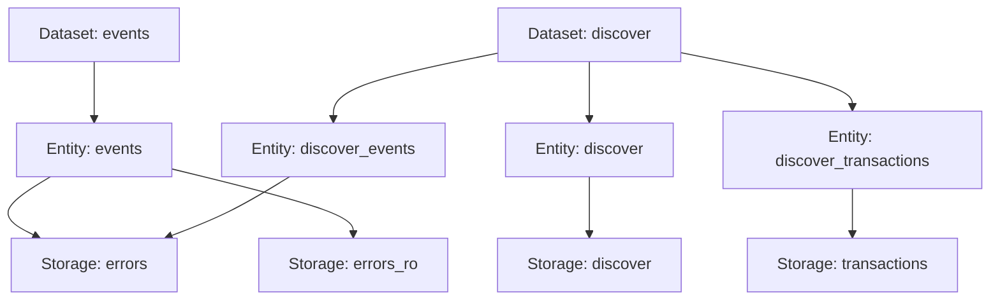

Datasets are the top-level organizational units in Snuba that group related entities. They provide a logical namespace for collections of data that are queried together.

## Overview

A dataset configuration is the simplest type of Snuba configuration file. It primarily serves to:

- Define a logical grouping of entities
- Provide a namespace for queries
- Organize related data models
- Enable dataset-level routing and permissions

## Schema

Dataset configurations follow the `v1` schema:

<ParamField path="version" type="string" required>
  Schema version. Must be `v1`.
</ParamField>

<ParamField path="kind" type="string" required>
  Component type. Must be `dataset`.
</ParamField>

<ParamField path="name" type="string" required>
  Unique name for the dataset. Used for routing queries and referencing the dataset programmatically.
</ParamField>

<ParamField path="entities" type="array">
  Array of entity names associated with this dataset. These must correspond to entity configuration files.
</ParamField>

## Basic Example

Here's a simple dataset configuration:

```yaml dataset.yaml
version: v1
kind: dataset
name: events

entities:
  - events
```

This configuration:
- Creates a dataset named `events`
- Associates it with a single entity named `events`
- The entity must be defined in a separate entity configuration file

## Complete Examples

<CodeGroup>
```yaml Events Dataset
version: v1
kind: dataset
name: events

entities:
  - events
```

```yaml Discover Dataset
version: v1
kind: dataset
name: discover

entities:
  - discover
  - discover_events
  - discover_transactions
```

```yaml Metrics Dataset
version: v1
kind: dataset
name: generic_metrics

entities:
  - generic_metrics_sets
  - generic_metrics_distributions
  - generic_metrics_counters
  - generic_metrics_gauges
```
</CodeGroup>

## Multi-Entity Datasets

Some datasets contain multiple entities that represent different views or subsets of the data:

```yaml dataset.yaml
version: v1
kind: dataset
name: discover

entities:
  - discover              # Combined view of events and transactions
  - discover_events       # Events-only view
  - discover_transactions # Transactions-only view
```

### When to Use Multiple Entities

Use multiple entities in a dataset when:

- **Different data types**: Events vs transactions, each with unique schemas
- **Performance optimization**: Separate hot and cold data paths
- **Different query patterns**: Read-only vs read-write access
- **Access control**: Different permission levels for different views

<Note>
Each entity in a dataset can have its own storage backend, query processors, and validators. This allows fine-grained control over data access and query optimization.
</Note>

## Dataset Registration

Datasets are loaded and registered at startup by the configuration loader:

```python
from snuba.datasets.configuration.dataset_builder import build_dataset_from_config
from snuba.datasets.factory import get_dataset

# Load from configuration
dataset = build_dataset_from_config("path/to/dataset.yaml")

# Access registered dataset
events_dataset = get_dataset("events")
```

## Querying Datasets

Queries are routed to datasets via the Snuba API:

<CodeGroup>
```bash cURL
curl -X POST http://localhost:1218/events/snql \
  -H "Content-Type: application/json" \
  -d '{
    "query": "MATCH (events) SELECT count() WHERE project_id IN (1, 2)",
    "dataset": "events"
  }'
```

```python Python SDK
from snuba_sdk import Request, Query, Condition, Column

query = Query(
    dataset="events",
    match="events",
    select=[Column("count()")],
    where=[Condition(Column("project_id"), "IN", [1, 2])]
)

request = Request(
    dataset="events",
    query=query
)
```
</CodeGroup>

## Directory Structure

Dataset configurations should follow this structure:

```bash
snuba/datasets/configuration/
└── {dataset_name}/
    ├── dataset.yaml              # Dataset configuration
    ├── entities/
    │   ├── {entity_1}.yaml      # Entity configurations
    │   ├── {entity_2}.yaml
    │   └── ...
    └── storages/
        ├── {storage_1}.yaml     # Storage configurations
        ├── {storage_2}.yaml
        └── ...
```

## Validation

Dataset configurations are validated against the JSON schema at startup:

```python
from snuba.datasets.configuration.json_schema import V1_DATASET_SCHEMA

# Schema structure
V1_DATASET_SCHEMA = {
    "title": "Dataset Schema",
    "type": "object",
    "properties": {
        "version": {"const": "v1"},
        "kind": {"const": "dataset"},
        "name": {"type": "string"},
        "entities": {
            "type": "array",
            "items": {"type": "string"}
        }
    },
    "required": ["version", "kind", "name"],
    "additionalProperties": False
}
```

### Common Validation Errors

<AccordionGroup>
  <Accordion title="Missing Required Fields">
    ```yaml
    # ❌ Missing 'version' field
    kind: dataset
    name: events
    ```
    
    **Error**: `'version' is a required property`
    
    **Fix**: Add the version field:
    ```yaml
    # ✅ Correct
    version: v1
    kind: dataset
    name: events
    ```
  </Accordion>

  <Accordion title="Invalid Kind Value">
    ```yaml
    # ❌ Wrong kind value
    version: v1
    kind: entity
    name: events
    ```
    
    **Error**: `data.kind must be equal to constant 'dataset'`
    
    **Fix**: Use the correct kind:
    ```yaml
    # ✅ Correct
    version: v1
    kind: dataset
    name: events
    ```
  </Accordion>

  <Accordion title="Entity Not Found">
    ```yaml
    version: v1
    kind: dataset
    name: events
    entities:
      - nonexistent_entity  # ❌ Entity file doesn't exist
    ```
    
    **Error**: Runtime error when loading entity
    
    **Fix**: Ensure entity configuration exists:
    ```bash
    snuba/datasets/configuration/events/entities/nonexistent_entity.yaml
    ```
  </Accordion>
</AccordionGroup>

## Dataset Naming Conventions

Follow these conventions when naming datasets:

- Use **lowercase** with underscores: `events`, `generic_metrics`
- Be **descriptive**: Name should indicate the data type
- Be **consistent**: Use similar patterns across datasets
- Avoid **abbreviations** unless widely understood

<CodeGroup>
```yaml Good Names
events
transactions
generic_metrics
sessions
replays
profiles
```

```yaml Avoid
ev        # Too abbreviated
EventData # Use lowercase
txns      # Not descriptive enough
data1     # Not meaningful
```
</CodeGroup>

## Integration with Entities

The relationship between datasets and entities:



## Migration from Code-Based Configuration

If you're migrating from code-based dataset definitions:

<Steps>
  <Step title="Create dataset.yaml">
    Create a new YAML file in `snuba/datasets/configuration/{dataset_name}/dataset.yaml`
  </Step>
  
  <Step title="Extract configuration">
    Extract dataset name and entity list from the Python class:
    
    ```python Old Python Code
    class EventsDataset(Dataset):
        def __init__(self):
            self.name = "events"
            self.entities = [EventsEntity()]
    ```
    
    ```yaml New YAML Config
    version: v1
    kind: dataset
    name: events
    entities:
      - events
    ```
  </Step>
  
  <Step title="Create entity configs">
    Create corresponding entity configuration files for each entity
  </Step>
  
  <Step title="Test configuration">
    Start Snuba and verify the dataset loads correctly:
    
    ```bash
    snuba devserver
    # Check logs for "Loading dataset: events"
    ```
  </Step>
  
  <Step title="Remove old code">
    Once validated, remove the old Python-based dataset definition
  </Step>
</Steps>

## Best Practices

<CardGroup cols={2}>
  <Card title="Keep It Simple" icon="sparkles">
    Datasets should be simple groupings. Complex logic belongs in entities and storages.
  </Card>
  
  <Card title="Logical Grouping" icon="layer-group">
    Group entities that are commonly queried together or represent related data.
  </Card>
  
  <Card title="Clear Naming" icon="tag">
    Use descriptive, unambiguous names that indicate the dataset's purpose.
  </Card>
  
  <Card title="Document Purpose" icon="book">
    Add YAML comments to explain the dataset's purpose and entity relationships.
  </Card>
</CardGroup>

## Related Configuration

<CardGroup cols={2}>
  <Card title="Entities" icon="cube" href="/configuration/entities">
    Configure entity schemas and query logic
  </Card>
  <Card title="Storages" icon="hard-drive" href="/configuration/storages">
    Set up storage backends for entities
  </Card>
</CardGroup>
