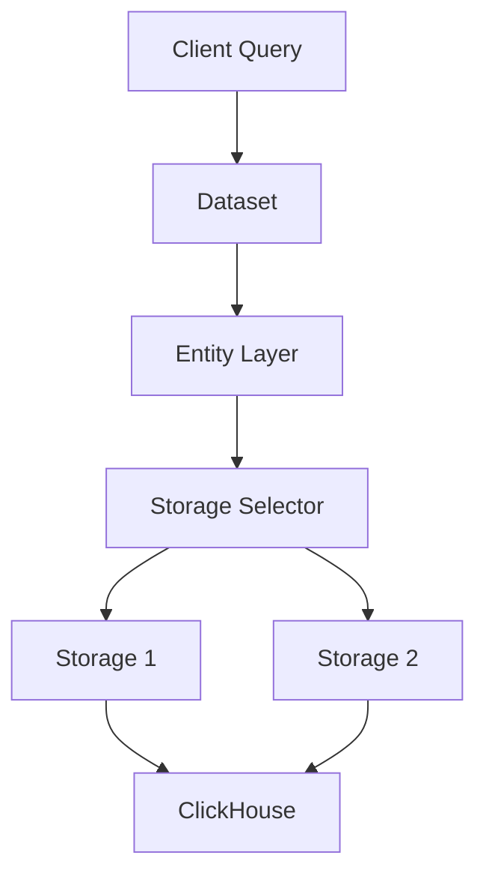

<Note>
Datasets are the primary organizational unit in Snuba, providing a logical grouping of entities and storages that represent different types of data ingested into ClickHouse.
</Note>

## What are Datasets?

A dataset in Snuba represents a logical collection of related data and defines the interface through which clients can query that data. Each dataset contains:

- **Entities**: Logical query interfaces that define schema and available columns
- **Storages**: Physical ClickHouse tables where data is stored
- **Query Processors**: Components that optimize and transform queries
- **Validators**: Rules that ensure query correctness and performance

## Core Datasets

Snuba provides several production datasets that power different Sentry features:

<CardGroup cols={2}>
  <Card title="Events" icon="bug" href="/datasets/events">
    Error and exception data with stack traces, user context, and tags
  </Card>
  <Card title="Transactions" icon="gauge-high" href="/datasets/transactions">
    Performance monitoring data with timing information and span details
  </Card>
  <Card title="Metrics" icon="chart-line" href="/datasets/metrics">
    Time-series metrics including counters, distributions, and sets
  </Card>
  <Card title="Replays" icon="circle-play" href="/datasets/replays">
    Session replay data with user interactions and browser events
  </Card>
</CardGroup>

## Dataset Architecture



### Configuration Structure

Datasets are defined using YAML configuration files located in `snuba/datasets/configuration/`. Each dataset requires:

```yaml
version: v1
kind: dataset
name: dataset_name

entities:
  - entity_name_1
  - entity_name_2
```

## Entity-Storage Relationship

<Note>
Entities provide the query interface while storages handle physical data organization. This separation allows for flexible query patterns and storage optimizations.
</Note>

### Entities

Entities define:
- Column schema with types
- Available query processors
- Validation rules
- Subscription capabilities
- Join relationships

### Storages

Storages define:
- Physical ClickHouse table names
- Partitioning strategies
- Data retention policies
- Allocation policies for rate limiting
- Stream loader configuration

## Query Flow

1. **Query Reception**: Client submits query through SnQL or API
2. **Entity Selection**: Dataset routes to appropriate entity
3. **Query Parsing**: Entity parses and validates query
4. **Query Processing**: Processors optimize and transform query
5. **Storage Selection**: Storage selector chooses optimal storage
6. **Query Execution**: Translated to ClickHouse SQL and executed
7. **Result Processing**: Results formatted and returned to client

## Data Ingestion

Each writable storage defines a stream loader that handles Kafka message processing:

```yaml
stream_loader:
  processor: ProcessorClass
  default_topic: topic-name
  commit_log_topic: commit-log-topic
  subscription_scheduler_mode: partition|global
```

<Accordion title="Stream Loader Configuration">
- **processor**: Message processor class that transforms Kafka messages
- **default_topic**: Primary Kafka topic for data ingestion
- **commit_log_topic**: Topic for tracking processed offsets
- **subscription_scheduler_mode**: How subscriptions are scheduled (partition or global)
- **subscription_delay_seconds**: Delay before subscription execution
</Accordion>

## Common Configuration Patterns

### Time-Based Partitioning

Most datasets use retention-based partitioning:

```yaml
partition_format:
  - retention_days
  - date
```

This allows efficient data deletion when retention periods expire.

### Allocation Policies

Datasets define resource allocation policies:

```yaml
allocation_policies:
  - name: ConcurrentRateLimitAllocationPolicy
    args:
      required_tenant_types:
        - organization_id
        - referrer
        - project_id
  - name: BytesScannedWindowAllocationPolicy
    args:
      required_tenant_types:
        - organization_id
```

### Query Processors

Processors optimize queries before execution:

```yaml
query_processors:
  - processor: UUIDColumnProcessor
    args:
      columns: [event_id, trace_id]
  - processor: MappingOptimizer
    args:
      column_name: tags
      hash_map_name: _tags_hash_map
```

## Schema Design

Snuba schemas use ClickHouse types with additional metadata:

```yaml
schema:
  - name: project_id
    type: UInt
    args: { size: 64 }
  - name: timestamp
    type: DateTime
  - name: tags
    type: Nested
    args:
      subcolumns:
        - { name: key, type: String }
        - { name: value, type: String }
```

### Type System

<CardGroup cols={3}>
  <Card title="Numeric" icon="hashtag">
    UInt, Int, Float with size parameters (8, 16, 32, 64)
  </Card>
  <Card title="String" icon="text">
    Variable-length strings stored as ClickHouse String
  </Card>
  <Card title="DateTime" icon="clock">
    DateTime and DateTime64 with optional precision
  </Card>
  <Card title="UUID" icon="fingerprint">
    128-bit unique identifiers
  </Card>
  <Card title="Nested" icon="folder-tree">
    Nested structures with subcolumns
  </Card>
  <Card title="Array" icon="list">
    Arrays of any base type
  </Card>
</CardGroup>

### Schema Modifiers

- **nullable**: Column can contain NULL values
- **readonly**: Column computed by storage, not queryable directly
- **lowcardinality**: Use ClickHouse LowCardinality optimization

## Validation System

Datasets enforce query validation at multiple levels:

```yaml
validators:
  - validator: EntityRequiredColumnValidator
    args:
      required_filter_columns:
        - project_id
  - validator: DatetimeConditionValidator
    args: {}
  - validator: TagConditionValidator
    args: {}
```

### Common Validators

- **EntityRequiredColumnValidator**: Ensures required columns in WHERE clause
- **DatetimeConditionValidator**: Validates time range queries
- **TagConditionValidator**: Optimizes tag-based queries
- **GranularityValidator**: Enforces minimum granularity for aggregations

## Best Practices

<AccordionGroup>
  <Accordion title="Always filter by project_id">
    Most datasets require project_id in the WHERE clause for performance and data isolation. This is enforced by validators.
  </Accordion>
  
  <Accordion title="Use appropriate time ranges">
    Limit queries to reasonable time ranges (typically < 90 days) to avoid scanning excessive data.
  </Accordion>
  
  <Accordion title="Leverage promoted tags">
    Use promoted tag columns (environment, release, etc.) directly rather than querying nested tag structures.
  </Accordion>
  
  <Accordion title="Understand storage selectors">
    Some entities use multiple storages. The storage selector chooses based on query characteristics.
  </Accordion>
</AccordionGroup>

## Migration System

Datasets support schema evolution through migrations:

```bash
# List available migrations
snuba migrations list

# Run pending migrations
snuba migrations migrate --dataset events

# Rollback migrations
snuba migrations reverse --dataset events
```

See [Migrations Overview](/migrations/overview) for detailed information.

## Next Steps

<CardGroup cols={2}>
  <Card title="Events Dataset" icon="bug" href="/datasets/events">
    Learn about error and exception data storage
  </Card>
  <Card title="Transactions Dataset" icon="gauge-high" href="/datasets/transactions">
    Explore performance monitoring data
  </Card>
  <Card title="Query with SnQL" icon="code" href="/query/snql">
    Write queries using Snuba Query Language
  </Card>
  <Card title="Storage Architecture" icon="database" href="/architecture/storage">
    Deep dive into ClickHouse storage design
  </Card>
</CardGroup>