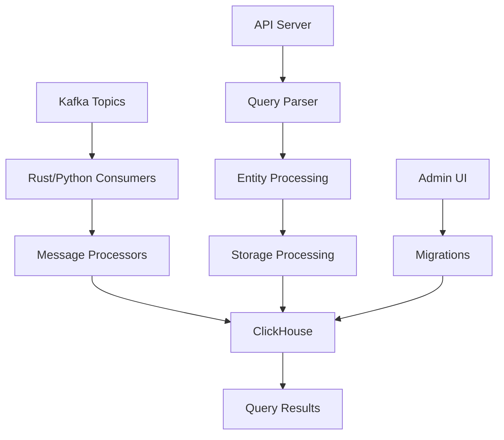

## What is Snuba?

Snuba is a service that provides a rich data model on top of ClickHouse together with a fast ingestion consumer and a query optimizer. It was originally developed to replace a combination of Postgres and Redis to search and provide aggregated data on Sentry errors. Since then, it has evolved to support most time series related features over several datasets.

## Key Features

<CardGroup cols={2}>
  <Card title="Database Access Layer" icon="database">
    Provides a comprehensive database access layer to the ClickHouse distributed data store with support for both single-node and distributed environments.
  </Card>
  
  <Card title="Logical Data Model" icon="diagram-project">
    Query a graph logical data model through SnQL (Snuba Query Language), providing functionalities similar to SQL with rich type safety and validation.
  </Card>
  
  <Card title="Multiple Datasets" icon="table">
    Support multiple separate datasets in a single installation, including events, transactions, metrics, profiles, replays, and more.
  </Card>
  
  <Card title="Query Optimizer" icon="gauge-high">
    Rule-based query optimizer that transforms and optimizes queries before execution for better performance.
  </Card>
</CardGroup>

## Core Concepts

Understanding Snuba's architecture requires familiarity with several key concepts:

### Datasets

A **Dataset** is a collection of entities that are related and can be queried together. Datasets provide a logical grouping of related data. For example:
- `events` - Error and issue data
- `transactions` - Performance monitoring data
- `metrics` - Time series metrics data
- `events_analytics_platform` - EAP items and spans

Each dataset defines which entities it contains and how they can be queried.

### Entities

An **Entity** represents a logical table that can be queried. Entities define:
- **Schema**: The columns available for querying with their types
- **Readable Storage**: The underlying storage layer for reading data
- **Writable Storage**: The storage layer for writing data (if applicable)
- **Query Processors**: Transformations applied to queries
- **Validators**: Validation logic for queries

Example entities include `events`, `transactions`, `metrics_counters`, `profiles`, and `search_issues`.

### Storages

A **Storage** provides an abstraction over ClickHouse tables. There are two types:

- **Readable Storage**: Abstracts reading from a ClickHouse table or view
- **Writable Storage**: Abstracts writing to a ClickHouse table

Storages define the physical data model including:
- Table names (local and distributed)
- Column definitions
- Query processors for storage-level transformations

### Query Languages

Snuba supports two primary query languages:

#### SnQL (Snuba Query Language)

SnQL is Snuba's native query language, providing a SQL-like syntax optimized for time series data:

```sql
MATCH (events)
SELECT count() AS event_count, platform
BY platform
WHERE timestamp >= toDateTime('2024-01-01T00:00:00')
  AND timestamp < toDateTime('2024-01-02T00:00:00')
  AND project_id = 1
ORDER BY event_count DESC
LIMIT 10
```

**Key Features:**
- Type-safe expression validation
- Entity-based data source specification
- Support for complex aggregations and functions
- Time range filtering with granularity control
- Tag and column subscript access

#### MQL (Metrics Query Language)

MQL is designed specifically for querying metrics data with a formula-based approach:

```python
sum(sentry.sessions.session){status:healthy} by (release)
```

MQL provides metrics-specific features like aggregation functions and grouping.

## Architecture Overview

Snuba's architecture consists of several key components:

### Ingestion Pipeline

<Steps>
  <Step title="Kafka Consumers">
    Snuba consumes data from Kafka topics using either Python or Rust consumers. The Rust consumers provide better performance and are now the default for most datasets.
  </Step>
  
  <Step title="Message Processing">
    Messages are parsed, validated, and transformed into rows suitable for ClickHouse insertion. Each dataset has a dedicated message processor.
  </Step>
  
  <Step title="Batching">
    Rows are batched together to optimize ClickHouse insert performance. Batch size is controlled by time and row count thresholds.
  </Step>
  
  <Step title="ClickHouse Insertion">
    Batches are written to ClickHouse tables using the HTTP interface with streaming for memory efficiency.
  </Step>
</Steps>

### Query Pipeline

<Steps>
  <Step title="Request Parsing">
    HTTP requests are parsed and validated. SnQL/MQL queries are transformed into Snuba's internal query representation.
  </Step>
  
  <Step title="Entity Processing">
    The query is processed at the entity level, applying entity-specific transformations and validations.
  </Step>
  
  <Step title="Storage Processing">
    The query is further processed for the specific storage backend, applying storage-level optimizations.
  </Step>
  
  <Step title="ClickHouse Execution">
    The final ClickHouse SQL query is executed and results are returned to the client.
  </Step>
</Steps>

### Components



**Key Components:**

- **API Server**: HTTP server that accepts SnQL/MQL queries and returns results
- **Consumers**: Kafka consumers that ingest data into ClickHouse
- **Replacer**: Handles data mutations and deletions
- **Admin UI**: Web interface for managing migrations and system configuration
- **Subscriptions**: Scheduled queries that run periodically
- **Migrations**: Schema management system for ClickHouse DDL changes

## Use Cases

Snuba excels at:

<CardGroup cols={2}>
  <Card title="Time Series Analytics" icon="chart-line">
    Query and aggregate time series data with automatic time bucketing and granularity control.
  </Card>
  
  <Card title="Error Tracking" icon="bug">
    Fast searching and aggregation of error events with support for grouping and filtering.
  </Card>
  
  <Card title="Performance Monitoring" icon="gauge">
    Analyze transaction and span data for application performance insights.
  </Card>
  
  <Card title="Metrics Analysis" icon="chart-bar">
    Query high-cardinality metrics data with efficient aggregation and grouping.
  </Card>
</CardGroup>

## System Requirements

<Note>
  Snuba requires the following services to run:
  - **ClickHouse** 25.3+ - Columnar database for data storage
  - **Kafka** - Message queue for data ingestion
  - **Redis** - Caching and state management
  - **Python 3.13+** - Runtime for Python components
  - **Rust** (optional) - For building Rust consumers
</Note>

## Performance Characteristics

### Batching Strategy

ClickHouse can only handle a limited rate of inserts (approximately 1 insert/second per shard). Snuba addresses this by:

- Batching rows before insertion
- Coordinating batch timing across consumer replicas
- Using streaming inserts to handle large batches without memory issues

<Warning>
  With 12 consumer replicas, each consumer should insert once every 12 seconds to maintain ~1 insert/second to ClickHouse.
</Warning>

### Query Optimization

Snuba applies multiple optimization techniques:

- **Query Processors**: Transform queries to use efficient ClickHouse functions
- **Storage Selection**: Route queries to the most appropriate storage backend
- **Predicate Pushdown**: Push filters down to ClickHouse for early filtering
- **Column Pruning**: Only select required columns to reduce data transfer

## Next Steps

<CardGroup cols={2}>
  <Card title="Quickstart" icon="rocket" href="/quickstart">
    Get Snuba running locally and execute your first query
  </Card>
  
  <Card title="Installation" icon="download" href="/installation">
    Learn about different installation methods and deployment options
  </Card>
</CardGroup>

## Additional Resources

- [Snuba GitHub Repository](https://github.com/getsentry/snuba)
- [ClickHouse Documentation](https://clickhouse.com/docs)
- [Sentry Documentation](https://docs.sentry.io)
